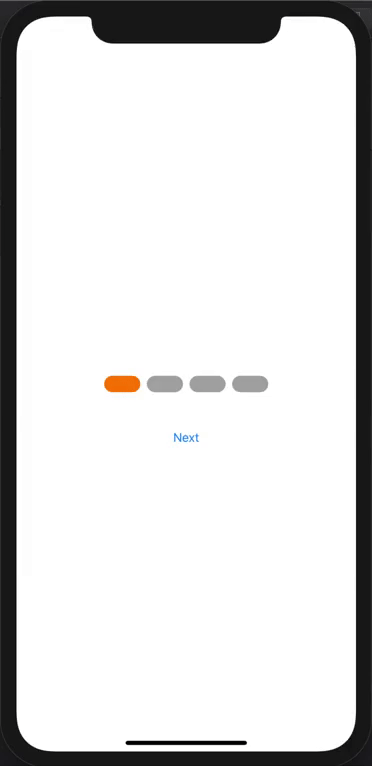
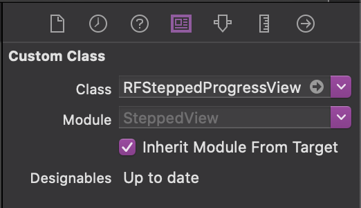
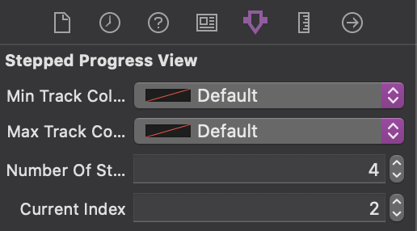

# SteppedProgressView
Stepped progress view for iOS using UIKit

## Example


## Requirements

- iOS 9.0
- Xcode 10.0+
- Swift 4.0+

## How To Use?
### Code:

```swift
import UIKit

@IBDesignable
class RFSteppedProgressView: UIView {

    var stackView = UIStackView()

    @IBInspectable var minTrackColor: UIColor = .orange {
        didSet {
            changeMinTrackColor(color: minTrackColor)
        }
    }

    @IBInspectable var maxTrackColor: UIColor = .lightGray {
        didSet {
            changeMaxTrackColor(color: maxTrackColor)
        }
    }

    @IBInspectable var numberOfSteps: Int = 0 {
        didSet {
            self.commonInit()
        }
    }

    @IBInspectable var currentIndex: Int = 0 {
        didSet {
            self.moveToStep(currentIndex)
        }
    }

    override init(frame: CGRect) { //Load from code
        super.init(frame: frame)

        commonInit()
    }

    required init?(coder: NSCoder) { //Load from IB
        super.init(coder: coder)

        commonInit()
    }

    func commonInit() {
        self.backgroundColor = .clear

        stackView.axis = .horizontal
        stackView.alignment = .fill
        stackView.distribution = .fillEqually
        stackView.spacing = 8

        for i in 0 ..< numberOfSteps {
            let view = UIView()
            view.tag = i + 1
            view.backgroundColor = maxTrackColor

            view.layer.cornerRadius = self.bounds.height / 2

            stackView.addArrangedSubview(view)
        }

        addSubview(stackView)

        //Setup constraints
        stackView.translatesAutoresizingMaskIntoConstraints = false

        NSLayoutConstraint.activate([
            stackView.leadingAnchor.constraint(equalTo: self.leadingAnchor),
            stackView.trailingAnchor.constraint(equalTo: self.trailingAnchor),
            stackView.topAnchor.constraint(equalTo: self.topAnchor),
            stackView.bottomAnchor.constraint(equalTo: self.bottomAnchor)
        ])
    }

    private func moveToStep(_ index: Int) {
        self.stackView.subviews.forEach { (view) in
            if view.tag <= index {
                view.backgroundColor = minTrackColor
            } else {
                view.backgroundColor = maxTrackColor
            }
        }
    }

    private func changeMinTrackColor(color: UIColor) {
        self.stackView.subviews.forEach { (view) in
            if view.tag <= currentIndex {
                view.backgroundColor = color
            }
        }
    }

    private func changeMaxTrackColor(color: UIColor) {
        self.stackView.subviews.forEach { (view) in
            if view.tag > currentIndex {
                view.backgroundColor = color
            }
        }
    }

}
```

### Storyboards:
If you're using Storyboards/Interface Builder you can create a `RFSteppedProgressView` instance by adding a normal UIView to your Storyboard, and then manually changing the view's class to `RFSteppedProgressView` in the "Custom Class" field of the Identity Inspector tab on the Utilities panel (the right-side panel).



### Customisation:
`RFSteppedProgressView` includes support for IBInspectable, to allow configuration of the color inside Interface Builder/Storyboards



## Author
Schaheer Saleem
